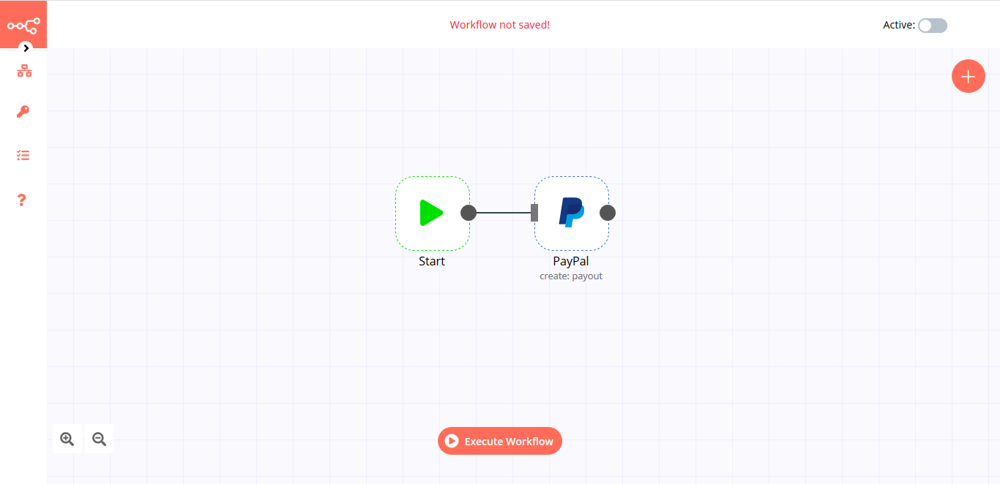

# PayPal

[PayPal](https://paypal.com) is a digital payment service that supports online funds transfers and that customers can use when shopping online.

::: tip 🔑 Credentials
You can find authentication information for this node [here](../../../credentials/PayPal/README.md).
:::

## Basic Operations

- Payout
	- Create a batch payout
	- Get payout details
- Payout item
	- Cancel an unpaid payout item
	- Get payout item details

## Example Usage

This workflow shows you how to create a PayPal batch payout. You can also find the [workflow](https://n8n.io/workflows/438) on this website. This example usage workflow uses the following two nodes.
- [Start](../../core-nodes/Start)
- [PayPal]()

The final workflow should look like the following image.

### 1. Start node

The Start node exists by default when you create a new workflow.

### 2. PayPal node

1. Click on the plus button, search for "PayPal", select it and double-click on the new node.
2. Select "Create new" in the *PayPal API* field.
3. Create a credential as shown in [this tutorial](../../../credentials/PayPal/).
4. Enter an ID in the *Sender Batch ID* field.
5. Click on *Execute Node* to run the workflow.
