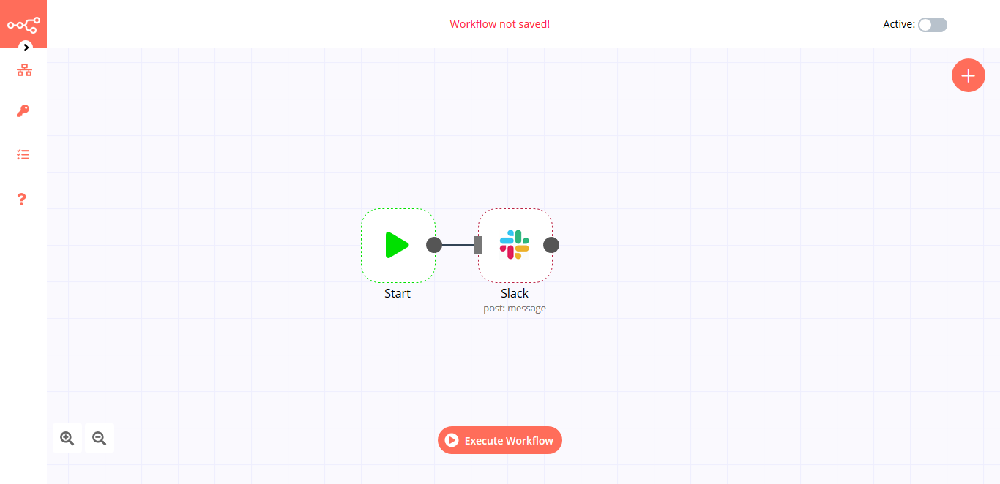

# Slack

[Slack](https://slack.com) is a business communication platform offering many IRC-style features, including persistent chat rooms (channels), private groups, and direct messaging.

::: tip 🔑 Credentials
You can find authentication information for this node [here](../../../credentials/Slack/README.md).
:::

## Basic Operations

- Channel
	- Archive a conversation
	- Close a direct message or multi-person direct message
	- Create a public or private channel-based conversation
	- Get information about a channel
	- Get all channels in a Slack team
	- Get a conversation's history of messages and events
	- Invite a user to a channel
	- Join an existing conversation
	- Kick a user from a channel
	- Leave a conversation
	- Open or resume a direct message or multi-person direct message
	- Rename a conversation
	- Get a thread of replies posted to a channel
	- Set the purpose for a conversation
	- Set the topic for a conversation
	- Unarchive a conversation
- File
	- Get a file's information
	- Get and filter a team's files
	- Upload an existing file or create a new one
- Message
	- Post a message in a channel
	- Update a message
- Star
	- Add a star to an item
	- Delete a star from an item
	- Get all the stars of an authenticated user

## Example Usage

This workflow shows you how to post a message in a Slack channel. You can also find the [workflow](https://n8n.io/workflows/416) on this website. This example usage workflow uses the following two nodes.
- [Start](../../core-nodes/Start)
- [Slack]()

The final workflow should look like the following image.

### 1. Start node

The Start node exists by default when you create a new workflow.

### 2. Slack Node

1. Click on the plus button, search for "Slack", select it and double-click on the new node.
2. Select OAuth2 in the *Authentication* field and select "Create new" in the *Slack OAuth2 API* field.
3. Create a credential as shown in [this tutorial](../../../credentials/Slack/).
4. Enter the name of the channel in the *Channel* field.
5. Enter the text of the message to be posted in *Text* field.
6. Browse the *Attachments*, *Other Options*, and *Blocks* to see if you would like to use any of them.
7. Click on *Execute Node* to run the workflow.
