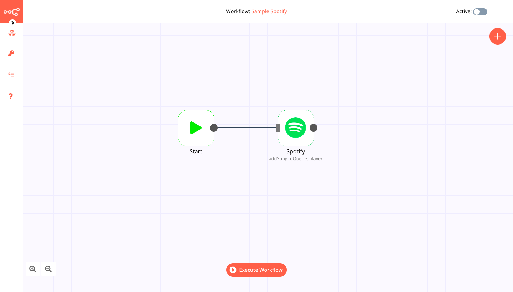

# Spotify

[Spotify](https://www.spotify.com/) is a music streaming service containing millions of music tracks and podcasts. Spotify allows users to create and manage their own playlists, explore new music through recommendation services, and listen to songs on demand.

You can find authentication information for this node [here](../../../credentials/Spotify/README.md).

## Basic Operations

- Album
    - Get an Album
    - Get an Album's Tracks
- Artist
    - Get an Artist
    - Get an Artist's Albums
    - Get an Artist's Related Artists
    - Get an Artists's Top Tracks
- Player
    - Add Song to Queue
    - Get the Currently Playing Song
    - Go to the Next Song
    - Pause Your Music
    - Go to the Previous Song
    - Get the Recently Played Song
    - Start Your Music
- Playlist
    - Add an Item to a Playlist
    - Get a Playlist
    - Get a Playlist's Tracks
    - Get a User's Playlists
    - Remove an Item from a Playlist
- Track
    - Get a Track
    - Get a Track's Audio Features

## Example Usage

This workflow allows you to add a song to your queue in Spotify. You can also find the [workflow](https://n8n.io/workflows/440) on the website. This example usage workflow would use the following two nodes.
- [Start](../../core-nodes/Start/README.md)
- [Spotify]()

The final workflow should look like the following image.

### 1. Start node

The start node exists by default when you create a new workflow.

### 2. Spotify node

1. First of all, you'll have to enter credentials for the Spotify node. You can find out how to do that [here](../../../credentials/Spotify/README.md).
2. Select the *Player* Resource.
3. Select the *Add Song to Queue* Operation.
4. Enter in the song's URI (or ID) to the *Track ID* field. The GIF demonstrates how to find the Track ID on Spotify's UI.
5. Click on *Execute Node* to run the workflow.

